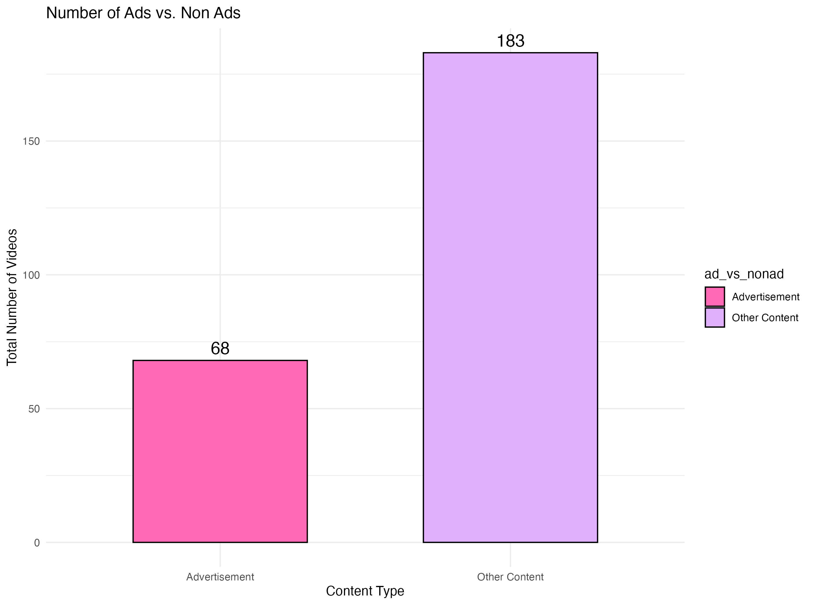

```{=html}
<script src="https://code.jquery.com/jquery-3.7.1.min.js" integrity="sha256-/JqT3SQfawRcv/BIHPThkBvs0OEvtFFmqPF/lYI/Cxo=" crossorigin="anonymous"></script>
```

```{r setup, include=FALSE}
knitr::opts_chunk$set(echo=FALSE, message=FALSE, warning=FALSE, error=FALSE)
```

```{js}
$(function() {
  $(".level2").css('visibility', 'hidden');
  $(".level2").first().css('visibility', 'visible');
  $(".container-fluid").height($(".container-fluid").height() + 300);
  $(window).on('scroll', function() {
    $('h2').each(function() {
      var h2Top = $(this).offset().top - $(window).scrollTop();
      var windowHeight = $(window).height();
      if (h2Top >= 0 && h2Top <= windowHeight / 2) {
        $(this).parent('div').css('visibility', 'visible');
      } else if (h2Top > windowHeight / 2) {
        $(this).parent('div').css('visibility', 'hidden');
      }
    });
  });
})
```

```{css}
.figcaption {display: none}
h1 {color: #FF69B4; 
  font-weight: bold;
  border-style: double;
  border-width: 4px;
  }
  
h2 { 
  color: #FF66CC; 
  font-weight: bold;
}

body {
background-color: #fff0f5
color: #E75480
}

```

## Examining Ads vs Non Ads Content Across Different Creator Groups



This bar graph shows the overall content landscape on TikTok, as it shows the total number of advertisement videos compared to other, non-advertisement content within the dataset I recorded between the 31st of March and the 13th of May. As you can see, the vast majority of videos I recorded were not advertisements (183 videos), while a smaller portion are ads (68 videos). At first glance, this meant suggest that a user's experience is primarily driven by actually organic content. However, within this user's experience they are still being presented with roughly 30% of ads. Independently, I was recording that TikTok would present me with an ad every 1 in 3.5 TikToks, however, this does not include other companies and individuals from promoting their own products without paying for an advertisement by TikTok. This is important to consider when analysing how TikTok's algorithm might treat different types of content and how it impacts creator strategies.


While overall advertisements constituted roughly 30% of the videos in my data set, the distribution of this promotional content varied significantly across creator types, with companies showing the highest proportion of ads compared to the individual creators and the "Other" category.

## Video Length and Engagement


One of the main objectives I wanted to understand based on the TikTok data I collected, was to find out if TikTok algorithm would promote longer videos than shorter videos. To understand this I used a ggplot to examine my data, specifically looking at the video lengths (in seconds) and their corresponding like count. In my graph I added a purple linear regression line to see if there was any linear relationship between these two variables. However, after observing the purple line, it appears almost flat with a slight downwards trend. Therefore, suggesting that there isn't a strong linear correlation between the two variables. However, with the high concentration of videos with shorter duration tending to be more consistent with the number of likes than longer length videos. This might suggest that for general content, for creators aiming to promote or advertise products, the TikTok algorithm could favour immediately engaging shorter videos than longer ones.

## Content Over Time: Ad and Organic Trends


This line graph illustrates the distribution of TikTok videos I encountered between the 31st of March and the 13th of May, categorised by whether they were advertisements or other content. The y-axis represents the number of videos I logged on specific dates indicated on the x-axis. The purpose of doing this allowed me to track the fluctuations in the pink line (advertisements) and the purple line (other content), thus I can observe how the volume of each type of video varied throughout my observation period. Therefore, this analysis enables me to understand if there were specific times or dates when my exposure to ads was higher or lower in relation to the other content I was shown.
